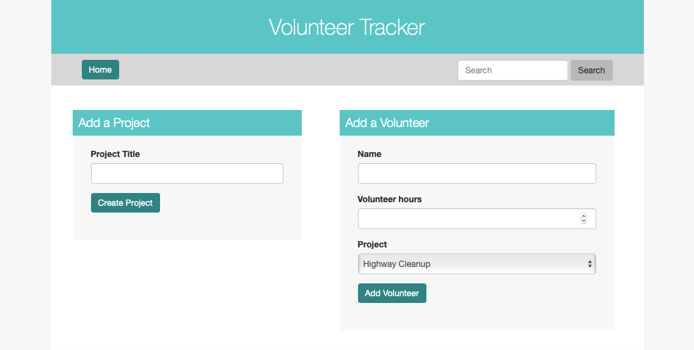
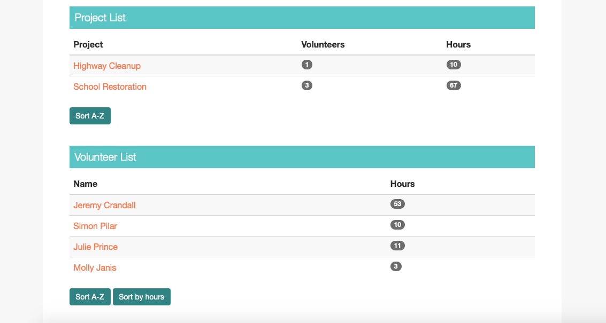

# Volunteer Tracker

#### Ruby Volunteer Tracker, 12.7.18

#### By Kristin Brewer-Lowe

## Description

This application is a volunteer tracker to enable a non-project to track their projects and volunteers. A user can add a project, add volunteers and associate volunteers with a specific project.

For each project, the the user can delete the project, update the project, or view project details, including associated volunteers and total hours worked on the project.

For each volunteer, the user can delete the volunteer, update the volunteer, or view volunteer details, including associated project and total hours worked.

Additionally, the user can sort their project and volunteer lists alphabetically. There is also search functionality, so the user is able to search the site by project title or volunteer name, and they will be directed to the appropriate details page.

Here's a screenshot of the homepage where a user can add projects and volunteers:

Here's a screenshot of the homepage where a user can view and sort their projects and volunteers:

## Setup/Installation Requirements

* In the command line, clone this repository with $ git clone https://github.com/klowe27/volunteer-tracker
* Navigate into the directory and in the command line install dependent gems by using command $ bundle install
* To create the necessary database, use the following commands in the command line while in the root directory (must have psql installed):
  * createdb volunteer_tracker
  * psql volunteer_tracker < my_database.sql
  * createdb -T volunteer_tracker volunteer_tracker_test
* To launch the application, while in the root directory use command $ ruby app.rb
* In any browser (preferably Chrome), navigate to http://localhost:4567/

## Known Bugs

* There is no form validation in place, so the user can submit blank form fields
* The site is not responsive and not optimized for smaller screens

## Support and contact details

If you have any questions or issues, please contact kristin.lowe1@gmail.com. Or, feel free to contribute to the code.

## Technologies Used

Ruby, Sinatra, psql, RSpec, Capybara, HTML, CSS, Pry, and Git.

### License

This software is licensed under the MIT license.

Copyright (c) 2018 **Kristin Brewer-Lowe**
